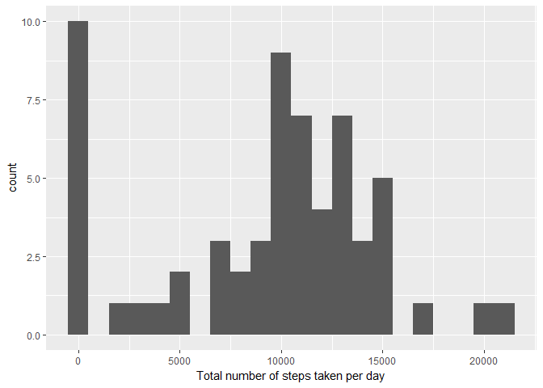
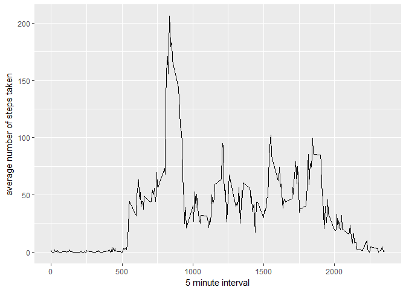
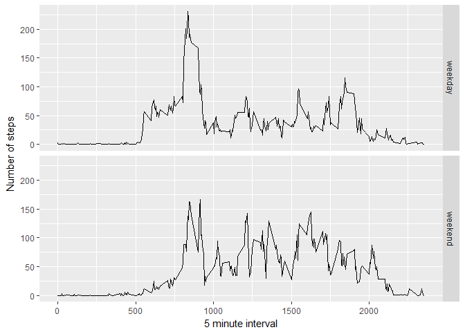

Reproducible Research Peer Assessment 1
=======================================

Loading and preprocessing the data
----------------------------------

    data <- read.csv('C:/Users/Micha/Desktop/Coursera/activity.csv')

What is the mean total number of steps taken per day?
-----------------------------------------------------

    library(ggplot2)
    totalsteps <- tapply(data$steps, data$date, FUN=sum, na.rm=TRUE)
    qplot(totalsteps, binwidth=1000, xlab="Total number of steps taken per day")

    mean(totalsteps, na.rm = TRUE)

    ## [1] 9354.23

    median(totalsteps)

    ## [1] 10395

What is the average daily activity pattern?
-------------------------------------------

    library(ggplot2)
    average.activity <- aggregate(x=list(steps=data$steps), by=list(interval=data$interval), FUN=mean, na.rm=TRUE)
    ggplot(data=average.activity, aes(x=interval, y=steps)) + geom_line() + xlab("5 minute interval") + ylab("average number of steps taken")

### Which 5 minute interval on average, across all of the days in the dataset, contains the maximum number of steps?

    average.activity[which.max(average.activity$steps),]

    ##     interval    steps
    ## 104      835 206.1698

Inputing missing values
-----------------------

### Total number of missing values in the dataset

    missing.values <- is.na(data$steps)
    sum(missing.values==TRUE)

    ## [1] 2304

### Stratey for filling in all of the missing values in the dataset

    fill.value <- function(steps, interval) {
      filled <- NA
      if (!is.na(steps)) 
        filled <- c(steps) else filled <- (average.activity[average.activity$interval == interval, "steps"])
        return(filled)}

### New dataset with no missinng values

    filled.data <- data

### Histogram of the total number of steps taken each day and calculate the mean and median total number of steps

    filled.data$steps <- mapply(fill.value, filled.data$steps, filled.data$interval)
    total.steps <- tapply(filled.data$steps, filled.data$date, FUN = sum)
    qplot(total.steps, binwidth = 1000, xlab = "Total number of steps taken each day")

    mean(total.steps)

    ## [1] 10766.19

    median(total.steps)

    ## [1] 10766.19

#### The newly derived mean and median values differ from the estimates from the first part of the assignment because we have input data for the previously missing NA values. The impact of inputing missing data is an increase in the total daily number of steps.

Are there differences in activity patterns between weekdays and weekends?
-------------------------------------------------------------------------

    weekday.vs.weekend <- function(date) {
       day <- weekdays(date)
      if (day %in% c("Monday", "Tuesday", "Wednesday", "Thursday", "Friday"))       return("weekday") 
       else if (day %in% c("Saturday", "Sunday")) 
      return("weekend") 
       else stop("invalid date")
    }

    filled.data$date <- as.Date(filled.data$date)
    filled.data$day <- sapply(filled.data$date, FUN = weekday.vs.weekend)
      
    averages <- aggregate(steps ~ interval + day, data = filled.data, mean)
    ggplot(averages, aes(interval, steps)) + geom_line() + facet_grid(day ~ .) + 
      xlab("5 minute interval") + ylab("Number of steps")

